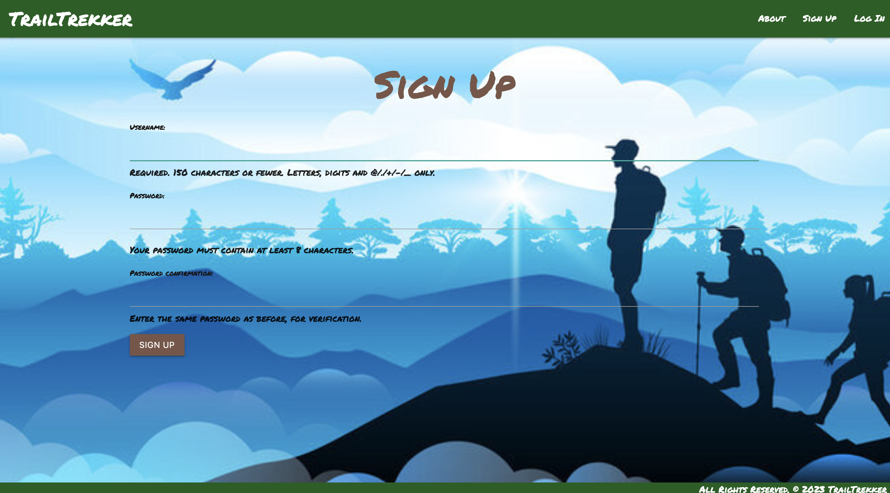
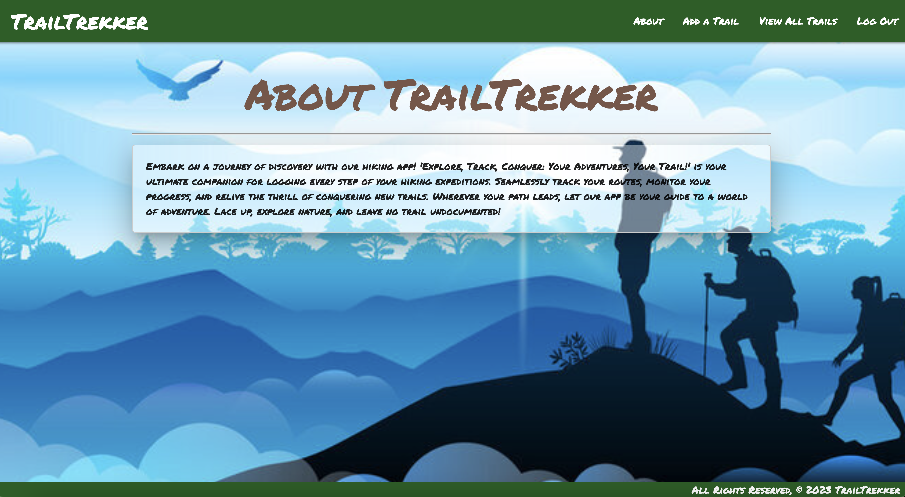
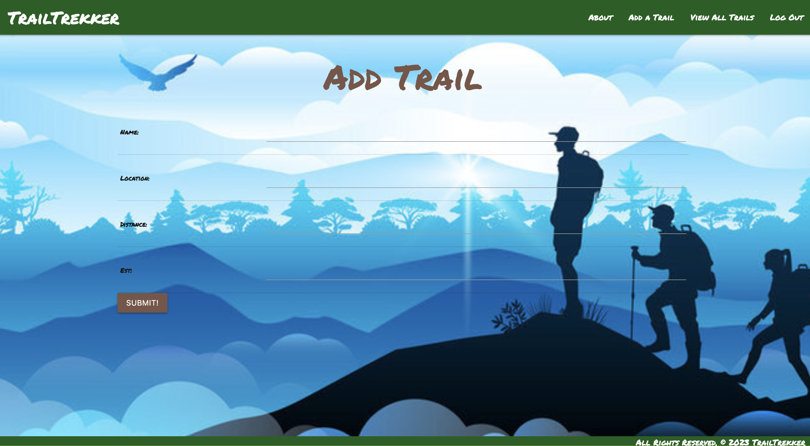
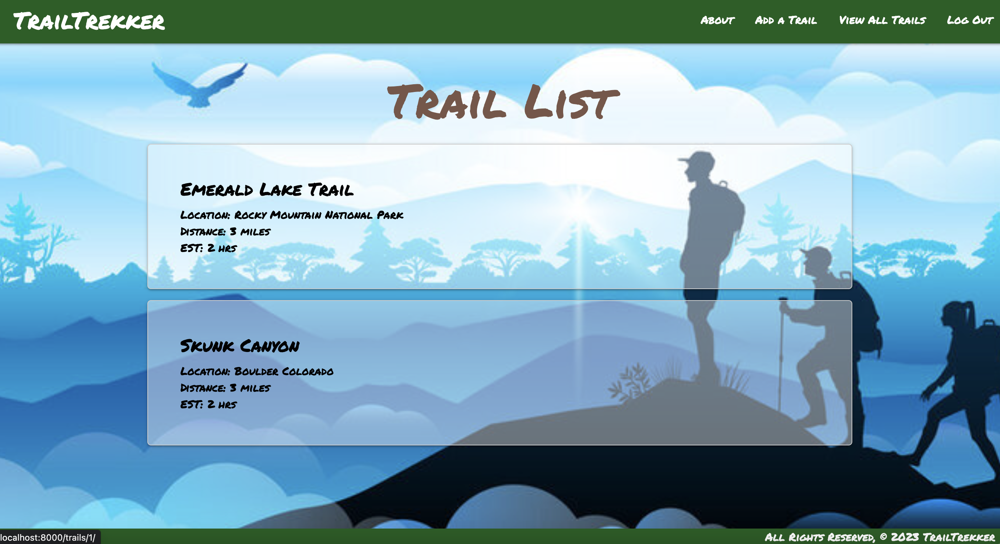
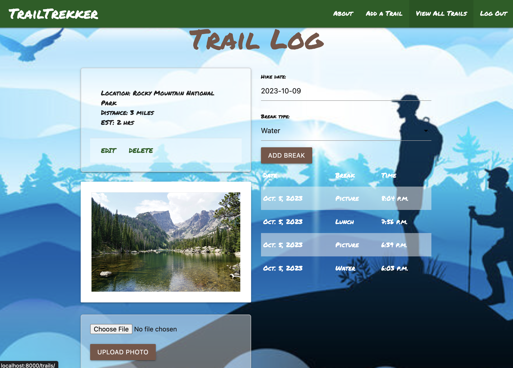

## TrailTrekker
- Embark on a journey of discovery with our hiking app! 'Explore, Track, Conquer: Your Adventures, Your Trail!' Trailtrekker is your ultimate companion for logging every step of your hiking expeditions. Seamlessly track your routes, monitor your progress, and relive the thrill of conquering new trails. Wherever your path leads, let our app be your guide to a world of adventure. Lace up, explore nature, and leave no trail undocumented!

## Images of Application
- Sign Up Page

- About Page

- Add Trail Page

- Trail List Page

- Trail Log Page

## Technologies Used
- Python
- Django
- PostgreSQL
- Materialize
- HTML
- CSS
- AWS (Amazon Web Services)
- Lucid Chart
- Trello

## Getting Started
- [Link to Application](https://trailtrekker-gfb2.onrender.com)
- [Project Planning](https://trello.com/b/OttwtEVi/trailtrekker)
- [Pitch Deck](https://docs.google.com/presentation/d/1VcvQ_TFt-frYQzj9jATjs8kFiLPz7fIrWArJXowF0AY/edit?usp=sharing)

## Next Steps
- Add checkpoints on the hike
- Add activities on the hike
- Add music on the app
- Add a picture of the trail hiked
- Add tags to hike (ex: mountains, lakes, beach)
